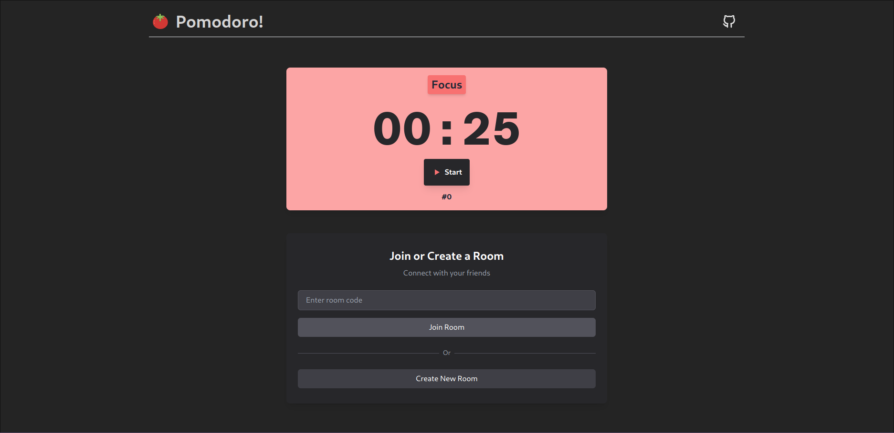

# Pomodoro!
A simple pomodoro to stay focus in company, powered by [SocketIO](https://socket.io/). It uses React and TailwindCSS in the client and NodeJS and Express in the server, in addition to SocketIO to handle bidirectional and low-latency communication 



## How to run
### Development
Web client will run on port 5173 and server on 3000 by default
```bash
pnpm install
pnpm dev
```
#### dependencies
- nodejs
- pnpm

### Production
Docker compose will up two containers, one for the client and another for the server. The client will run on port 80 and the server on 3000.
```bash
make build
make run
```
#### dependencies
- make
- docker
- docker-compose